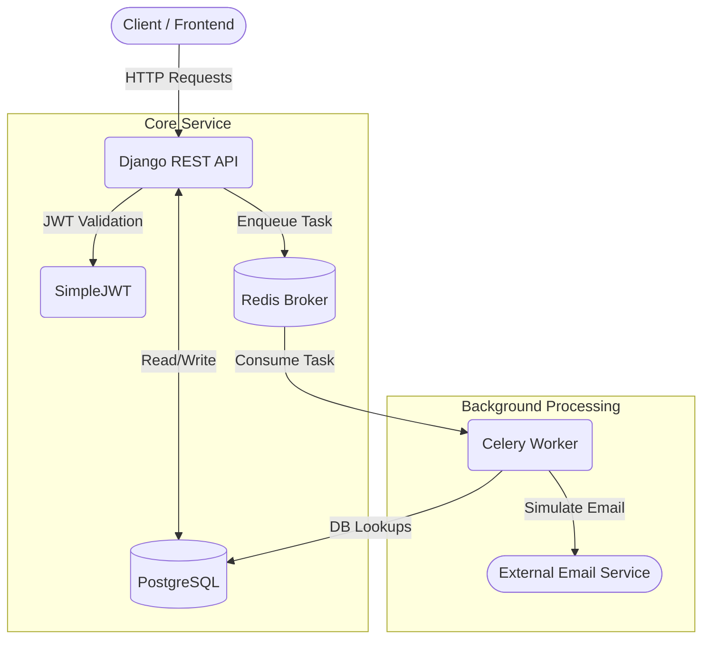
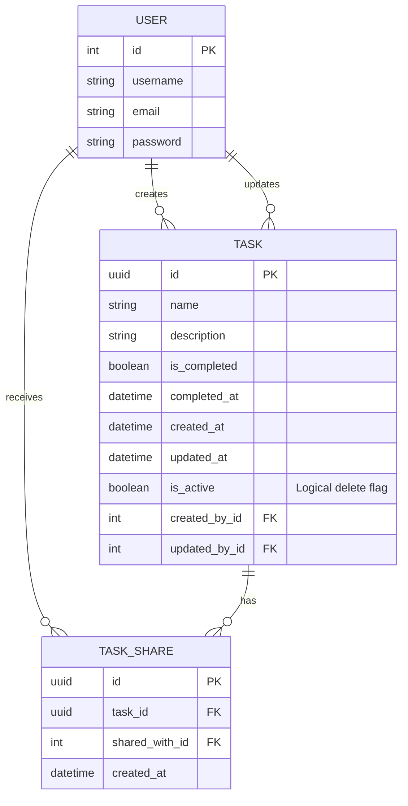

# TaskShare Service

TaskShare is a Django REST Framework (DRF) application designed to manage and share tasks between users. It features JWT authentication, logical deletion, data ownership rules, and asynchronous background processing (e.g., sending emails) powered by Celery and Redis.

## 🏗️ Architecture

The system follows a standard modern Django architecture, offloading heavy processes to a queue.



## 🗄️ Database Schema (ER Diagram)

The core domain focuses on Users, Tasks, and the relationships between them.


*Note: The `TaskShare` table ensures a Many-to-Many relationship so multiple users can have access to the same task.*

---

## 🚀 Getting Started

### 1. Prerequisites
- [Docker & Docker Compose](https://www.docker.com/) (For PostgreSQL and Redis)
- [uv](https://github.com/astral-sh/uv) (Extremely fast Python package installer and resolver)

### 2. Environment Variables
Create a `.env` file in the root of the project based on the provided `.env.mock`:

```bash
cp .env.mock .env
```

**`.env` Example Config:**
```env
ENV=local

POSTGRES_DB=taskshare
POSTGRES_PASSWORD=postgres
POSTGRES_USER=postgres
POSTGRES_PORT=5432
POSTGRES_HOST=localhost

SECRET_KEY=django-insecure-your-secret-key-here
```

### 3. Setup & Installation
Using the built-in `Makefile`, you can quickly get up and running:

1. **Install Python dependencies:**
   ```bash
   make install-local
   ```

2. **Run the Database & Server:**
   This command starts PostgreSQL and Redis via Docker, and then starts the Django development server on port 8000.
   ```bash
   make run-local
   ```

3. **Run Migrations:**
   In a new terminal pane, apply the database schema.
   ```bash
   make apply-migrations
   ```

4. **Start the Celery Worker:**
   In a third terminal pane, start the worker to handle background tasks (like the simulated emails).
   ```bash
   make run-worker
   ```

---

## 🛠️ Makefile Commands Cheat Sheet

| Command | Description |
| :--- | :--- |
| `make install-local` | Installs Python dependencies using `uv`. |
| `make run-local` | Starts Docker containers (DB/Redis) and the Django dev server. |
| `make down-local` | Stops and removes the Docker containers. |
| `make run-worker` | Starts the Celery foreground worker. |
| `make makemigrations` | Detects model changes and builds migration files. |
| `make migrate` | Applies pending migrations to PostgreSQL. |
| `make apply-migrations`| Runs `makemigrations` followed immediately by `migrate`. |
| `make createsuperuser` | Creates an admin user to access the `localhost:8000/admin` panel. |
| `make lint` / `lint-fix` | Checks code formatting using `ruff` (and fixes them). |

---

## 📖 API Documentation

Once the server is running (`make run-local`), you can access the interactive Swagger documentation generated automatically by `drf-spectacular`:

👉 **Interactive Swagger UI:** [http://localhost:8000/api/schema/swagger-ui/](http://localhost:8000/api/schema/swagger-ui/)

### Quick Test Flow:
1. Use `POST /api/v1/auth/register/` to create two users.
2. Use `POST /api/v1/auth/login/` with `user1` to get an `access` token.
3. Use `POST /api/v1/tasks/` (sending `Bearer <token>` in header) to create a task.
4. Use `POST /api/v1/tasks/{id}/share/` with `{"user_id": 2}` to share it with `user2`. Look at the Celery terminal to see the simulated email output!
